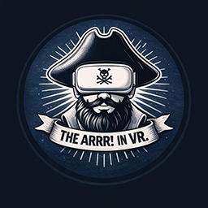

<div align="center">



# r/QuestPiracy Community Megathread

### The community-driven QuestPiracy resource hub

**Live site →** [**QPMegathread.top**](https://qpmegathread.top)

</div>

---

## Alright, we're doing this properly now.

We just launched a community-driven QP Megathread site and this is where things start getting better.

## What this is

Reddit megathreads:

- Get buried
- Get outdated
- Get locked
- Turn into comment spam

**This fixes that.**

This site is:

- Always up to date
- Clean and organized
- Not buried under comments
- Maintained by the community

## How it works (simple)

1. The site is hosted on **GitHub Pages** from this repo
2. Anyone can suggest changes
3. You submit a **Pull Request**
4. Mods review it
5. If approved, it goes live instantly

No reposting. No waiting. No mess.

## The BIG difference (read this)

> **This is NOT Reddit.**
>
> That means: **we are NOT restricted the same way.** We can include links that would never be allowed there.

**BUT** &mdash; we're not turning this into a dumping ground. So the rules are:

- **No unsafe/scam sites**
- **If something is listed as "steer clear" on the major megathreads, do NOT submit it here.** IDC how many years you supposedly used it without getting a virus. It only takes one virus to make you never go back. Just because every game isn't a virus doesn't make it safe.
- **Just because something isn't listed doesn't automatically make it safe** &mdash; but doesn't automatically make it unsafe either. Use your head.
- **Everything must be on-topic** and useful to QuestPiracy.

## Important rule about links

To keep things clean:

> **Sensitive / risky links will NOT be on the main index page.**

They go into:

- Proper sections
- Organized pages
- Clearly separated areas

This keeps the front page clean while still allowing useful resources to exist. This lets us link to the site on Reddit right in that grey area.

**Also: no linking individual games.** This isn't a forum. **We are linking SOURCES.**

## Why this matters

We don't want:

- Broken/outdated info
- The same questions over and over
- Important info buried in comments
- Our megathread or subreddit nuked by Reddit

We DO want:

- A real, living resource
- Fast updates
- Community-driven improvements

## What we need help with

We're just getting started &mdash; so everything.

We need:

- Tools
- Guides
- Resources
- Better organization
- Corrections

If you've ever helped someone in the comments before &mdash; **this is where that effort actually scales.**

---

## Repo layout &mdash; where things go

```
QP-Megathread/
├── index.html              # Homepage (locked – maintainers only)
├── CNAME                   # Custom domain (locked)
├── assets/
│   ├── css/style.css       # Styles (locked)
│   ├── js/main.js          # Scripts (locked)
│   └── images/             # Logos, screenshots, icons (OPEN to PRs)
├── pages/                  # ← YOU EDIT THESE
│   ├── quest-standalone.html
│   ├── pcvr.html
│   ├── dev-mode.html
│   ├── rookies-json.html
│   ├── tools.html
│   └── ideas.html
└── .github/
    └── CODEOWNERS          # Who reviews what
```

### Which page does my contribution go on?

| If you want to add&hellip; | Put it in&hellip; |
|---|---|
| A Quest standalone source/site/app | `pages/quest-standalone.html` |
| A PCVR source, store, mod repo | `pages/pcvr.html` |
| Dev-mode steps, ADB, drivers, prerequisites | `pages/dev-mode.html` |
| Rookies sideloader JSON / `@the_vrSrc` mirrors | `pages/rookies-json.html` |
| A community-made tool (Standalone / PCVR / General) | `pages/tools.html` |
| A wishlist item or feature idea | `pages/ideas.html` |
| A logo, screenshot, or any image asset | `assets/images/` |

## What's locked vs open

| Path | Who can merge |
|---|---|
| `index.html` | Maintainers only |
| `assets/css/`, `assets/js/`, `assets/data/` | Maintainers only |
| `CNAME`, `.github/` | Maintainers only |
| **`pages/**`** | **Anyone via PR** |
| **`assets/images/`** | **Anyone via PR** |

Enforced by [`.github/CODEOWNERS`](.github/CODEOWNERS) + a GitHub Ruleset on `main`.

The homepage is locked so the directory stays clean and on-brand &mdash; everything else is open season.

## Basic rules

- No spam
- No garbage links
- Keep things organized
- Don't remove content without reason
- Use the correct sections

**Good contributions will get approved. Simple as that.**

## How to contribute

1. Go to the [site](https://qpmegathread.top) and find the section your contribution belongs in
2. Click through to the GitHub repo (or open it [here](https://github.com/KaladinDMP/QP-Megathread))
3. Edit or add the file in `pages/` &mdash; you can do it straight in the GitHub web UI
4. Submit a **Pull Request** describing what you added and why
5. A maintainer reviews, merges, and it's live

That's it.

### Quick-start checklist for a PR

- [ ] My change is in the right page/section
- [ ] No individual game links &mdash; only sources
- [ ] No "steer clear" / known-sketchy sites
- [ ] I'm not touching `index.html` unless I'm a maintainer
- [ ] The PR description explains what and why

## The goal

**Build something better than a Reddit thread.**

Something that:

- Doesn't get buried
- Doesn't get outdated
- Isn't restricted the same way
- Doesn't rely on one person

A real, community-maintained resource.

If you've been around here for a while, you already know what's missing. Now there's finally a place to fix it.

**Let's build something that actually works.**

---

<div align="center">

Made by the r/QuestPiracy community &bull; [qpmegathread.top](https://qpmegathread.top)

</div>
